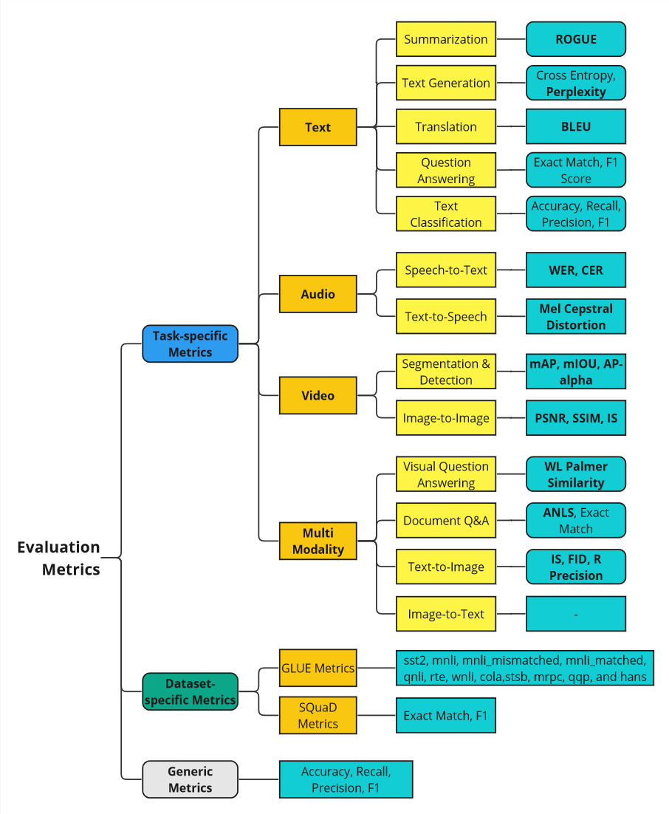

# Benchmarking LLMs & Evaluation Metrics

- [Benchmarking LLMs and what is the best LLM?](https://msandbu.org/benchmarking-llms-and-what-is-the-best-llm/)
- [ChatGPT's training data can be exposed via a "divergence attack"](https://stackdiary.com/chatgpts-training-data-can-be-exposed-via-a-divergence-attack/)
- [The Guide To LLM Evals: How To Build and Benchmark Your Evals](https://towardsdatascience.com/llm-evals-setup-and-the-metrics-that-matter-2cc27e8e35f3)
- [LLM Benchmarks: How can we say that LLaMa-2 is the best?](https://medium.com/@patrykmwieczorek/llm-benchmarks-how-can-we-say-that-llama-2-is-the-best-8f546280c26c)

Evaluating machine learning models is crucial, standard accuracy-based metrics don’t always tell the full story. To thoroughly assess model performance, it is important to evaluate various capabilities beyond just accuracy or loss metrics. 

- For language tasks (LLMs), this includes analyzing generated text for topic coherence, semantic consistentcy, fluency, grammaticality, logical consistency and reasoning capabilities. 
- For computer vision models, this includes analyzing capabilities on compositional tasks, bounding box overlap with ground truth, overlap between predicted and ground truth masks, robustness to corruptions like noise or blurring, and adversarial attacks. 
- Across modalities, evaluating safety factors such as biases, discrimination, and fairness.

Model evaluation metrics can be grouped into three main categories:
- Generic Metrics
- Task-oriented Metrics
- Dataset-oriented Metrics

View in [MIRO Board](https://miro.com/app/board/uXjVN_e-aEM=/?share_link_id=105927867730)

- [SuperGLUE: Understanding a Sticky Benchmark for LLMs](https://deepgram.com/learn/superglue-llm-benchmark-explained)
- [Benchmark of LLMs (Part 1): Glue & SuperGLUE, Adversarial NLI, Big Bench](https://medium.com/@myschang/benchmark-of-llms-part-1-glue-superglue-adversarial-nli-big-bench-8d1aed6bae12)
- [Two minutes NLP — SuperGLUE Tasks and 2022 Leaderboard](https://medium.com/nlplanet/two-minutes-nlp-superglue-tasks-and-2022-leaderboard-492d8c849ed)
- [GLUE Explained: Understanding BERT Through Benchmarks](https://mccormickml.com/2019/11/05/GLUE/)

A quick overview of few commonly used evalution metrics along with Google Colab Notebooks to evaluate metrics.

## Text Summarization Metrics

**Extractive vs Abstractive**

There are two types of text summarization that a human, and nowadays a machine, can do.

- **Extractive**: Words and phrases are directly extracted from the text.
- **Abstractive**: Words and phrases are generated semantically consistent, ensuring the key information of the original text is maintained.

## ROUGE

ROUGE is used as an initial indicator of how much the machine-written summary overlaps with the human written summary, because it _does not take into account the semantic meaning and the factual accuracy_ of the summaries.

#### ROUGE-N

ROUGE-N calculates the ratio of matching n-grams between the candidate (model-generated text) and reference summaries (uman-produced reference text) over the total number of n-grams in the reference summaries. It is a measure of overlap content-wise between the candidate and reference summaries.

$$ROUGE-N = \frac{\sum\limits_{S \in {Reference Summaries}} \sum\limits_{gram_n \in S} Count_{match}(gram_n)}{\sum\limits_{S \in {Reference Summaries}} \sum\limits_{gram_n \in S} Count(gram_n)}$$

Where:
- $N$: Size of n-gram
- $Count_{match}(gram_n)$: Number of matching n-grams between the candidate and reference summaries
- $Count(gram_n)$: Number of n-grams in the reference summaries.
- $S$: Reference summary
- ${Reference Summaries}$: Set of reference summaries

#### ROUGE-L 

ROUGE-L is based on the longest common subsequence (LCS) between model-generated text and a human-produced reference.

- The longest sequence of words (not necessarily consecutive, but still in order) that is shared between both.
- A longer shared sequence should indicate more similarity between the two sequences.

Refer to this [article](https://medium.com/nlplanet/two-minutes-nlp-learn-the-rouge-metric-by-examples-f179cc285499) to compute ROUGE-L recall, precision, and F1-score.

#### ROUGE-S

ROUGE-S allows us to add a degree of leniency to the n-gram matching performed with ROUGE-N and ROUGE-L. ROUGE-S is a skip-gram concurrence metric: this allows to search for consecutive words from the reference text that appear in the model output but are separated by one-or-more other words.

- **BLEU focuses on precision**: how many the words (and/or n-grams) in the machine-generated text appear in the human-produced reference.
- **ROUGE focuses on recall**: how many the words (and/or n-grams) in the human-produced references appear in the machine-generated model outputs.

---
## Text Translation Metrics

### BLEU

BLEU, or the Bilingual Evaluation Understudy, is a metric for comparing a candidate translation to one or more reference translations.

Although developed for translation, it can be used to evaluate text generated for different natural language processing tasks, such as paraphrasing and text summarization.

The BLEU score is not perfect, but it’s quick and inexpensive to calculate, language-independent, and, above all, correlates highly with human evaluation.

https://medium.com/nlplanet/two-minutes-nlp-learn-the-bleu-metric-by-examples-df015ca73a86

## Text Generation Metrics

### Perplexity

A language model is a probability distribution over sentences.
A language model is a probability matrix between a word and the next word that occurs in the corpus of the training set

Perplexity, known as PP, is “the inverse probability of the test set, normalised by the number of words”. In the Perplexity equation below, there are N words in a sentence, and each word is represented as w, where P is the probability of each w after the previous one. Also, we can expand the probability of W using the chain rule as followed.

$PP(W) = P(w_1 w_2 w_3 ... w_N)^{\frac{1}{N}}$

$= \sqrt[N]{\frac{1}{P(w_1 w_2 w_3 ... w_N)}}$

$= \sqrt[N]{\Pi_{i=1}^{N}\frac{1}{P(w_i\|w_{i-1})}}$

https://medium.com/nlplanet/two-minutes-nlp-perplexity-explained-with-simple-probabilities-6cdc46884584

---

## WER - Word Error Rate

Word error rate (WER) is a common metric of the performance of an automatic speech recognition (ASR) system.

The WER is derived from the Levenshtein distance, working at the word level.

$WER = \frac{(S + D + I)}{N}$

where,
S = Number of substitutions
D = Number of deletions
I = Number of insertions
N = Number of words in the reference.

