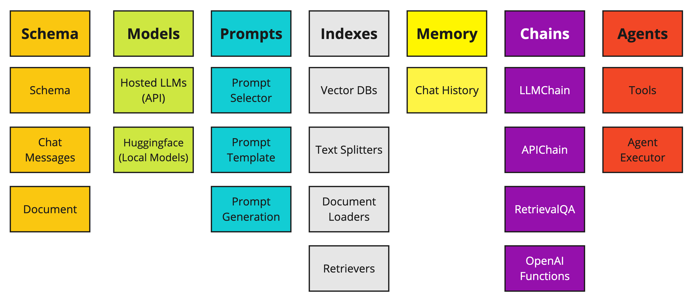
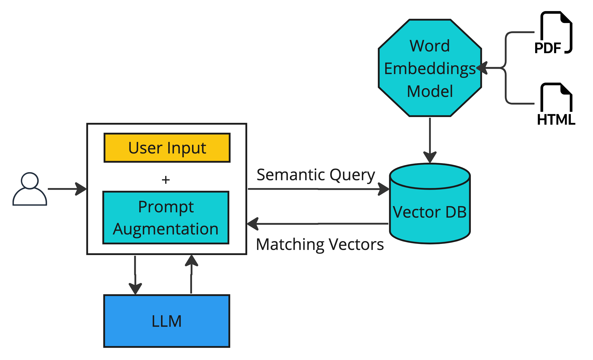

# LLM-powered Autonomous AI Agents

> In near future, Large Language Models (LLMs) will be virtually part of every software product to make them more autonomous and enhance user experience (UX).

🚧 <strike>Doc is under construction</strike> 🚧

Large Language Models have potential use beyond text generation, summarization, and code generation, as they can act as **reasoning engines**. They can be,
- turned into a powerful general problem solver.
- extend to automate complex workflows with several intervined tasks.
- could power autonomous systems.

LLMs powering idea of Autonomous AI Agents. These Autonomous LLM "agents" or "copilots" are new generation of AI assistants which can perform complex tasks when commanded to by a human, without needing close supervision. They can make logical decisions, and handle a number of tasks without consistent human intervention.

A new role "AI Engineer" is emerging, with accountability to productize large language models. They integrate developed models into software products.

Source: [Latent Space](https://www.latent.space/p/ai-engineer)

## What are Autonomous LLM Agents?

“Autonomous” LLM agents are goal-driven, self-executing software that can plan, execute and priortize tasks to achieve a certain goal. They translate natural language prompts into actions and execute them.

Here are few browser-based autonomous LLM agents,
- [AgentGPT](https://agentgpt.reworkd.ai/) - Assemble, configure, and deploy autonomous AI Agents in your browser.
- [BabyAGI](https://babyagi.org/) - AI-powered task management system that uses OpenAI and Pinecone APIs to create, prioritize, and execute tasks.
- [Godmode.space](https://godmode.space/) - Explore the Power of Generative Agents on Godmode.space. Inspired by Auto-GPT and BabyAGI. Supports GPT-3.5 & GPT-4.
- [AutoGPT](https://github.com/Significant-Gravitas/Auto-GPT)(non-browser based) - A program, driven by GPT-4, chains together LLM "thoughts", to autonomously achieve whatever goal you set. As one of the first examples of GPT-4 running fully autonomously, Auto-GPT pushes the boundaries of what is possible with AI.

Autonomous agents achieve specified goals by breaking it into tasks, execute them independently without human intervention. Agents use a LLM to determine which actions to take and in what order. The agent creates a **Chain-of-Thought** sequence on the fly by decomposing the user request.

## How do Autonomous LLM Agents Work?

Agents make use of LLMs & tools to perform actions in autonomous fashion. LLMs act as agent’s brain, wherein tools enable an agent to take certain actions. Agents follow a Chain-of-Thought reasoning approach to decompose a problem into sequence of steps. 

Agents are autonomous with regards to,
1. Plan steps to solve a problem or achieve a goal using chain-of-thought reasoning.
2. For each step in steps:
    1. Decide which **tool** to accomplish the step
    2. Use tool to peform best course of **action** and record **observation**.
    3. Observation is then passed back into agent, and it decides what step to take next.
3. Agent repeats "Action" -> "Observation" -> "Thought" cycle, until it reaches satisfactory answer.

## How to build Autonomous LLM Agents?

Critical components of autonomous agent are,

#### Task Planning

Agent decomposes complex tasks or goals into smaller steps. Task decomposing is done through LLM prompting. Different prompting techniques can be employeed such as,
1. ReAct - Reason and Act. See LangChain prompt template [here](https://github.com/langchain-ai/langchain/blob/master/libs/langchain/langchain/agents/react/wiki_prompt.py).
2. Modular Reasoning, Knowledge and Language (MRKL) prompt. See LangChain prompt template [here](https://github.com/langchain-ai/langchain/blob/master/libs/langchain/langchain/agents/mrkl/prompt.py)
3. [Plan and execute](https://python.langchain.com/docs/modules/agents/agent_types/plan_and_execute)

#### Tools

Tools are interfaces that an agent can use to interact with the world. These tools can be generic utilities (e.g. search), other chains, or even other agents.

Tools can be,
- [Shell Tool](https://python.langchain.com/docs/integrations/tools/bash)
- [Search Tools](https://python.langchain.com/docs/integrations/tools/ddg)
- [Requests](https://python.langchain.com/docs/integrations/tools/requests)
- Others ...

#### Memory

Chains and Agents are stateless, meaning that they treat each incoming query independently. Memory involves keeping a concept of state around throughout a user's interactions with an language model.

### Frameworks & Libraries

Popular frameworks to build LLM powered applications,

|  LangChain |  LlamaIndex |  Chainlit |
| --- | --- | --- |
|[LangChain](https://www.langchain.com/) is an open-source Python library that enables anyone who can write code to build LLM-powered applications.  The package provides a generic interface to many foundation models, enables prompt management, and acts as a central interface to other components like prompt templates, other LLMs, external data, and other tools via agents.| [LlamaIndex](https://www.llamaindex.ai/) is an open-source project that provides a simple interface between LLMs and external data sources like APIs, PDFs, SQL etc. It provides indices over structured and unstructured data, helping to abstract away the differences across data sources. It can store context required for prompt engineering, deal with limitations when the context window is too big, and help make a trade-off between cost and performance during queries. | [Chainlit](https://docs.chainlit.io/overview) library is similar to Python’s Streamlit Library. This library is seamlessly integrated with LangFlow and LangChain(the library to build applications with Large Language Models), which we will do later in this guide. Chainlit even allows for visualizing multi-step reasoning.

LangChain framework components,

### Vector Datatabases

#### Why Vector Databases needed in context of LLMs.

By default, the LLMs bases its responses on textual content it has ingested during training. The training data may not include company's private data resulting inaccurate answer. To make LLM base its answer on private unseen data, we can agument user query with more context. For example, a legal document, a technical manual, or search results. We can then instruct the model to generate its answer based on that data. 

To faster agument data relevant to user query, you can use 'Search Engines'. But they are only capable of keyword search

Vector databases provide efficient and quicker way to augument models with relevant context informaton. They have advanced indexing and search algorithms top perform efficient similiarity searches. 

#### What is a vector?
A vector is an array of numbers like [0, 1, 2, 3, 4, … ]. Vector can represent more complex objects such as words, sentences, images, and audio files in an embedding.

#### What is Word Embedding? 
In the context of large language models, embeddings represent text as a dense vector of numbers to capture the meaning of words. They map the semantic meaning of words together or similar features into vectors. These embeddings can then be used for search engines, recommendation systems, and generative AIs such as ChatGPT. 

More concepts,
- [What is Tokenization?](https://ankur3107.github.io/blogs/intro-to-tokenization-using-openai-chatgpt/)
- [Which tokenization method ChatGPT uses?](https://huggingface.co/learn/nlp-course/chapter6/5?fw=pt)
- [What is difference between Tokens & Word Embeddings?](https://medium.com/@saschametzger/what-are-tokens-vectors-and-embeddings-how-do-you-create-them-e2a3e698e037)

- Vector databases can measure the distance between two vectors, which defines their relationship. Small distances suggest high relatedness, while larger distances suggest low relatedness.
- Vector databases enhance the memory of LLMs thorugh context injection. Prompt augmentation feeds LLMs with contextual data.

Most popular vector databases are,

| Pinecone | Chroma | Weaviate |
| --- | --- | --- |
| Pinecone is a cloud-based vector database designed to efficiently store, index and search extensive collections of high-dimensional vectors. | Chroma is an open source vector database that provides a fast and scalable way to store and retrieve embeddings.  Chroma is designed to be lightweight and easy to use, with a simple API and support for multiple backends, including RocksDB and Faiss (Facebook AI Similarity Search) | Weaviate is an open source vector database designed to build and deploy AI-powered applications. Weaviate’s key features include support for semantic search and knowledge graphs and the ability to automatically extract entities and relationships from text data.|

## Example: Autonomous Travel Agent

An autonomous travel agent powered by LLMs such as ChatGPT to automate airline ticket booking process.

It uses ReAct prompting techinque. It allow the model to “reason” (with a chain-of-thoughts) and “act” (by being able to use a tool from a predefined set of tools, such as being able to search the internet).

#### Demonstration

https://github.com/venkataravuri/ai-ml/tree/master/llm-powered-autonomous-agents

#### Code Walkthrough

https://github.com/venkataravuri/ai-ml/blob/master/llm-powered-autonomous-agents/pages/1_%E2%9B%93%EF%B8%8F_React.py

## Example: Tanzu Kubernetes Autonomous AI Agent

A sample autonoums agent that peforms Tanzu Kubernetes automation activities.

### Demo & Code Walkthrough

https://github.com/venkataravuri/ai-ml/blob/master/llm-powered-autonomous-agents/pages/2_%E2%9C%8D%EF%B8%8F_Plan_and_Execute.py

### Credits & References
- https://www.eweek.com/artificial-intelligence/autonomous-ai-agents/
