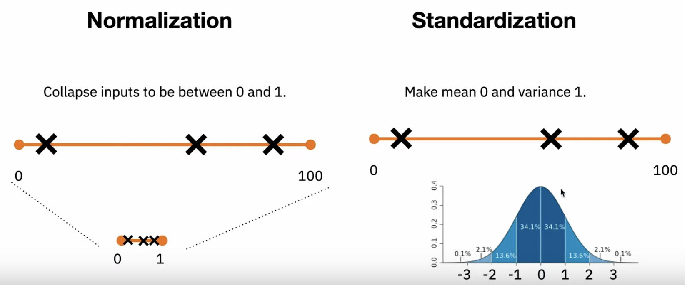

# Machine Learning
- [Concepts - Statistics & Linear Algebra]()
- [Activation Functions](#activation-functions)
- [Loss Functions](#loss-functions)
- [Evaulation Metrics](#evaluation-metrics)

## Concepts - Statistics & Linear Algebra

probability in order to convey our predictive insights with certain degree of certainty.

## Probability Distribution

**Probability** is the chance of event occurring success(1) or failure(0).

**Distribution** means how the ‘possible values’ a variable can take and how they occur.

probability distribution represents the values of a variable that holds the probabilities of an experiment

distribution is useful when we need to know,
- which outcomes are most likely,
- the spread of potential values,
- and the likelihood of different results.

**probability mass function** is a function that gives the probability that a **discrete** random variable is exactly equal to some value. 

**probability density function** represents the density of a **continuous** random variable lying between a specific range of values.

Discrete Distributions :

Discrete distributions have finitely many outcomes, equal outcomes are called Equiprobability. Events with only two possible outcomes [True/False], so any event with two outcomes can be transformed into a Bernoulli Distribution.

This is a univariate probability distribution, which is the probability distribution of a single random variable. This is in contrast to a bivariate or multivariate probability distribution, which defines the probability distribution of two or more random variables.

Check out this site to learn about 76 types of univariate distribution

|Binomial Distribution|Bernoulli Distribution|Poisson Distribution|
|---|---|---|
|exactly two mutually exclusive outcomes of a trial, like flipping a coin (heads/tails) and outcome of a match (win/loss). ||Represents how many times an event can occur over a specific time period.|
|||Examples, <br />• The number of users who visited a website in an interval can be thought of as a Poisson process.|
|||The probability mass function is given by:<br/>|
|Problem Statement: Hospital records show that of patients suffering from a specific disease, `75%` die of it. What is the probability that of six randomly selected Patients, four will recover?|||
|Problem Statement: A (blindfolded) marksman finds that on the average, he hits the target `4` times out of `5`. If he fires `4` shots, what is a probability of (a) more than `2` hits and (b) at least `3` misses?|||

https://medium.com/analytics-vidhya/probability-statistics-for-beginners-in-machine-learning-part-3-probability-distribution-9bce0567fdcf

|Uniform distribution |Normal distribution (Or) Gaussian distribution (Or) Bell Curve|Exponential distribution|
|---|---|---|
|uniform distribution specifies an equal probability across a given range of continuous values. In other words, it is a probability distribution with a constant probability.||Describes how long it takes for a continuous process to change state. The exponential distribution is the probability distribution of the time between events in a Poisson point process.|
||Problem Statement: We have a dataset representing the weights of students in a school. Assume that the dataset is normally distributed with a mean of 60 kg and standard deviation 15 kg, represented by 𝑁(60,15). What is the probability that a randomly selected person has a weight below 50 kgs?||


#### What are Logits in machine learning?

Logits interpreted to be the unnormalised (or not-yet normalised) predictions (or outputs) of a model. These can give results, but we don't normally stop with logits, because interpreting their raw values is not easy.

[Logits Explanation](https://datascience.stackexchange.com/questions/31041/what-does-logits-in-machine-learning-mean)|

In a classification problem, the model’s output is usually a vector of probability for each category. Often, this vector is usually expected to be “logits,” i.e., real numbers to be transformed to probability using the softmax function, or the output of a softmax activation function.

#### Why we want to wrap everything with a logarithm?

1. It’s related to the concept in information theory where you need to use log(x) bits to capture x amount of information.
2. Computers are capable of almost anything, except exact numeric representation.

## Feature Engineering

### Encoding Methodologies

### Nominal Encoding - Where Order of data does not matter

Nominal data is defined as data that is used for naming or labelling variables, without any quantitative value.

|One Hot Encoding|One Hot Encoding with many categorical (like Pincode)|Mean Encoding|Frequency Encoding|
|---|---|---|---|
|Frequency of the categories as labels|• Suppose there are more than 20 categories of a variable then we can’t apply direct One Hot Encoding. <br />• Find most top k categories repeating most frequent. <br />• Then take that k category and create k new features.|• Mean Encoding or Target Encoding is similar to label encoding, except here labels are correlated directly with the target.<br/>• For example, in mean target encoding for each category in the feature label is decided with the mean value of the target variable on a training data.||
|||||
|For high cardinality features, this method produces a lot of columns that slows down the learning significantly.<br/> One hot encoding produces the number of columns equal to the number of categories and dummy producing is one less.||Advantages: <br/>• Capture information within the label, therefore rendering more predictive features<br/>• Creates a monotonic relationship between the variable and the target. <br/>Disadvantages:<br/>• It may cause over-fitting in the model.||

### Ordinal Encoding — Where Order of data matters

Ordinal data is a categorical data type where the variables have natural, ordered categories and the distances between the categories are not known. Example: Rating, rank, etc.

|Label Encoding|Target guided Ordinal Encoding|Count Encoding|
|---|---|---|
|Map each categorical feature value to an integer number starting from 0 to cardinality-1, where cardinality is the count of the feature’s distinct values.|Map each category to a new feature vector that contains 1 and 0 denoting the presence of the feature or not. The number of new feature vectors depends on the categories which we want to keep.|Labels are given on the bases of the mean. Highest the mean, highest the label<br/>Ordering the labels according to the target variable.<br/>Replace the labels by the joint probability.|Replace the categories with there count.<br/>It is used when are lots of categories of a variable.<br/>It does not create a new feature.<br/>Disadvantage: If the same labels have the same count then replaced by the same count and we will lose some valuable information.|
||||


## Balanced and Imbalanced datasets

In machine learning, class imbalance is the issue of target class distribution.

|Balanced datasets|Imbalanced datasests|
|---|---|
|For balanced datasets, the target class distribution is nearly equal.| For imbalanced datasest, the target distribution is not equal.|
|Balanced datasets<br/>• A random sampling of a coin trail<br/>• Classifying images to cat or dog<br/>• Sentiment analysis of movie reviews|Class Imbalance dataset<br/>• Email spam or ham dataset<br/>• Credit card fraud detection<br/>• Network failure detections|

### Techniques for handling imbalanced data

|Oversampling|Undersampling|Ensemble Techniques|
|---|---|---|
|Increase the number of samples in minority class to match up to the number of samples of the majority class.|Decrease the number of samples in the majority class to match the number of samples of the minority class.|Ensemble methods, which combine multiple base learners to produce a more accurate and robust model, can be adapted to handle imbalanced data effectively|
|||Bagging for Imbalanced Data - Bagging, or bootstrap aggregating, involves training multiple base learners on different random subsets of the data and combining their predictions.<br/>Boosting for Imbalanced Data - Boosting is an ensemble method that trains a series of base learners sequentially, where each learner tries to correct the errors made by its predecessor. 

[Reference](https://dataaspirant.com/handle-imbalanced-data-machine-learning/)

#### What is distiction between Gradient and Derivative?

A gradient is a vector that goes in the direction of a function’s sharpest ascend whereas a derivative quantifies the rate of shift of a function at a certain location.

- The derivative of a function is the change of the function for a given input.
- The gradient is simply a derivative vector for a multivariate function.
 - Although both ideas include calculating slopes, derivatives emphasize one variable while gradients take into account a few variables at once. [Source](https://allthedifferences.com/exploring-the-distinction-gradient-vs-derivative/)

#### What is the Difference Between Gradient and Partial Derivative?

A gradient represents the vector pointing in the direction of the steepest ascent of an equation and encompasses partial derivatives about all variables, whereas a partial derivative reflects the rate of shift of a function about one particular variable while keeping other variables at a single value.

### Optimization Methods

#### Gradient Descent

**Gradient Descent** is an optimization method used to optimize the parameters of a model using the gradient of an objective function (loss function in NN). It optimizes the parameters until the value of the loss function is the minimum (of we've reached the minima of the loss function). It is often referred to as back propagation in terms of Neural Networks.

#### Stochastic Gradient Descent

**Stochastic Gradient Descent** computes the gradients for each and every sample in the dataset and hence makes an update for every sample in the dataset. For a dataset of 100 samples, updates occur 100 times.

#### Batch Gradient Descent

**Batch Gradient Descent**
The samples from the whole dataset are used to optimize the parameters i.e to compute the gradients for a single update. For a dataset of 100 samples, updates occur only once.

#### Mini-batch Gradient Descent
**Mini Batch Gradient Descent**, instead of a single sample ( Stochastic GD ) or the whole dataset ( Batch GD ), we take small batches or chunks of the dataset and update the parameters accordingly. For a dataset of 100 samples, if the batch size is 5 meaning we have 20 batches. Hence, updates occur 20 times.

## Regularization

**Overfitting** occurs when a model learns to perform exceptionally well on the training data but fails to perform well on new, unseen data.

**Regularization** helps in preventing the overfitting of the model and the learning process becomes more efficient.

Regularization techniques,
- Early stopping
- Dropout
- Weight initialization techniques
- and _batch normalization_.

**Regularization** is a set of techniques designed to prevent overfitting and enhance the generalization ability of a model.

Regularization is a technique used to avoid overfitting where the coefficients, if needed, are restricted or shrunken to zero. 

Reducing the impact of less important features directly affects the quality of predictions as it reduces the _degree of freedom_ which in turn makes it harder for the model to get more complex or overfit the data.

Regularization methods introduce additional constraints or penalties to the learning process to ensure that the model does not become overly complex and is better suited for making accurate predictions on new data.

A penalty term is added to the cost function which lets us control the type and amount of regularization to be performed on the model at hand. This is done by modifying the traditional Linear Regression Cost function that is shown below.

```math
J(\theta) = MSE(\theta) = (\frac{1}{m}).\displaystyle\sum_{i=1}^{n}(\theta^T x^{(i)} - y^{(i)})^2
```
<p align="center">Linear Regression Cost Function</p>

Ridge Regression :

This type of regularized regression has a penalty term representing half the square of L2 norm added to the cost function. This forces the learning algorithm to not only fit the data but also keep the model weights as small as possible. The equation for Ridge Regression is shown below.

```math
J(\theta)_{Ridge} = MSE(\theta) + \lambda.(\frac{1}{2}).\displaystyle\sum_{i=1}^{n}(\theta^2_{i})
```
<p align="center">Ridge Regression Cost Function</p>

> The L2 norm is the sum of the squares of the differences between predicted and target values over the feature vector. Its also known as Euclidean Distance and Root Mean Square Error (RMSE).

The shrinkage hyperparameter λ (lambda) controls the amount of regularization and needs to be chosen properly because if λ = 0, then Ridge Regression is the same as Linear Regression and on the other hand, if λ is very large, then all weights end up very close to zero resulting in an underfitting model. One good way to select the right λ is to perform cross-validation.

#### Lasso Regression

Short for Least Absolute Shrinkage and Selection Operator Regression, this type of Regularized Regression uses the L1 norm instead of half the square of L2 norm as the penalty term in the cost function. An important characteristic of Lasso Regression is that it tends to completely eliminate the weights of the least important features and thus, automatically performs feature selection.

> The L1 norm is the sum of the magnitudes of the differences between predicted and target values over the feature vector or could be understood as the sum of absolute differences. Its also known as Manhattan Distance, Taxicab Norm, and Mean Absolute Error (MAE).

```math
J(\theta)_{Ridge} = MSE(\theta) + \lambda.\displaystyle\sum_{i=1}^{n}(|\theta_{i}|)
```
<p align="center">Lasso Regression Cost Function</p>

The shrinkage hyperparameter λ works similar to as in Ridge Regression, too little results in no regularization and too much ends up in an underfit model.

The key difference between Ridge and Lasso regression is that even though both the regression techniques shrink the coefficients closer to zero, only Lasso regression actually sets them to zero if the shrinkage parameter is large enough. Thus, resulting in a model having a selected set of features (sparse model) making it much easier to interpret and work with.

Elastic Net Regression :

This kind of regression is simply a mix of both, Ridge and Lasso Regressions. The penalty term in Elastic Nets is a combination of both absolute value and squared value penalties.

> Elastic Net first emerged as a result of critique on Lasso, whose variable selection can be too dependent on data and thus unstable. The solution is to combine the penalties of Ridge regression and Lasso to get the best of both worlds. (Source)
>
> 
```math
J(\theta)_{Ridge} = MSE(\theta) + r.\lambda.\displaystyle\sum_{i=1}^{n}(|\theta_{i}|) +  [{(1-r)/2}].\alpha.\displaystyle\sum_{i=1}^{n}(\theta^2_{i})
```
<p align="center"Elastic Nets Cost Function</p>

The mix between Ridge and Lasso regularization can be controlled by the Ratio hyperparameter (r). When r = 0, Elastic Net is equivalent to Ridge Regression and when r = 1, it is equivalent to Lasso Regression.

#### What is Normalization?

Normalization is a data pre-processing tool used to bring the numerical data to a common scale without distorting its shape.

#### Normalization Vs. Standardization

||[](https://www.youtube.com/watch?v=of4-jeKtyB4)|
|----|----|

#### Batch Normalization

Batch Normalization is a supervised learning technique that converts interlayer outputs into of a neural network into a standard format, called normalizing. 

This approach leads to faster learning rates since normalization ensures there’s no activation value that’s too high or too low, as well as allowing each layer to learn independently of the others. For each layer in the neural network, batch normalization normalizes the activations by adjusting them to have a standardized mean and variance.

In a deep learning network, batch normalization affects the output of the previous activation layer by subtracting the batch mean, and then dividing by the batch’s standard deviation.

#### What is difference between Cosine Similarity & Ecludian Distance?


Cosine similarity is a measure of similarity between two non-zero vectors of an inner product space that measures the cosine of the angle between them. 

- It is thus a judgment of orientation and not magnitude (length)
- two vectors with the same orientation have a cosine similarity of 1 (The cosine of 0° is 1)
- two vectors oriented at 90° relative to each other have a similarity of 0
- and two vectors diametrically opposed have a similarity of -1, independent of their magnitude. 

- Cosine similarity is generally used as a metric for measuring distance when the magnitude of the vectors does not matter. 
- Text data is the most typical example for when to use this metric.

### Bayes Theorem

**Conditional Probability** is the probability that something will happen, given that something else has already happened.

```
P(A | B) = P(B | A) x P(A)/P(B)
```

Pr(A | B): Conditional probability of A : i.e. probability of A, given that all we know is B;  Probability of A happening given that B has already happened. P(A|B) is the conditional probability.

"Probability of A given B" is the same as the "probability of B given A" times the "probability of A" divided by the "probability of B".

**Understanding Bayes Rule**

P(Outcome given that we know some Evidence) = P(Evidence given that we know the Outcome) times Prob(Outcome), scaled by the P(Evidence)

The classic example to understand Bayes' Rule:

```
Probability of Disease D given Test-positive = 

               P(Test is positive|Disease) * P(Disease)
     _______________________________________________________________
     (scaled by) P(Testing Positive, with or without the disease)
```

**Naive Bayes'**


## Evaluation Metrics

### Confustion Matrix

A confusion matrix is a table used to evaluate the performance of a _classification model_ by comparing its predictions to the actual ground truth labels.

It provides a summary of the model’s true positive (TP), true negative (TN), false positive (FP), and false negative (FN) predictions for each class in a multi-class classification problem or for the positive class in a binary classification problem.


|Metric|Description|Formula|Interpretation|
|---|---|---|---|
|**Accuracy**|Accuracy measures the overall correctness of the model’s predictions.|$\frac{(TP + TN)}{(TP + TN + FP + FN)}$|• It is calculated as the ratio of the correctly predicted instances (TP + TN) to the total number of instances in the dataset.<br/>• In **imbalanced datasets**, _accuracy may not be a reliable measure_, as a high accuracy score could be driven by the model’s ability to predict the majority class accurately while performing poorly on the minority class.|
|**Precision**|Precision measures the proportion of true positive predictions among the instances predicted as positive.|$\frac{(TP)}{(TP + FP)}$|• How accurate the positive predictions are?<br/>• It is useful when the cost of false positives is high, and you want to minimize the number of false positives.<br/>• Use precision when the cost of false positives is high and you want to minimize false alarms or false positive predictions. (minimizing false positives)<br/>• For example, in fraud detection, precision is crucial because it indicates how many flagged cases are actually true frauds, reducing the need for manual investigation of false positives.|
|**Recall** (Sensitivity or True Positive Rate)| measures the proportion of true positive predictions among all instances that are actually positive..|$\frac{(TP)}{(TP + FN)}$|• Use recall when the cost of false negatives is high, and you want to ensure that you capture as many positive instances as possible, even at the expense of some false positives. (minimizing false negatives)<br/>• For example, in medical diagnosis, a high recall rate is crucial because it means correctly identifying individuals with a disease, even if it leads to some false alarms.|
|**Specificity**||$\frac{(TP)}{(TP + FP)}$|• Coverage of actual negative sample.|
|**F1 score**| is the harmonic mean of precision and recall, providing a balanced metric for situations where both precision and recall are important.|$2 . \frac{(TP)}{(TP + FN)}$|• F1 score strikes a balance between precision and recall in the presence of an imbalanced dataset.<br/>• For example, in sentiment analysis of customer reviews, F1 score is a suitable metric when dealing with imbalanced sentiment classes. It helps strike a balance between correctly identifying positive and negative sentiment reviews, taking into account both precision and recall.|

### ROC
ROC The receiver operating curve, also noted ROC, is the plot of TPR versus FPR by varying the threshold. These metrics are are summed up in the table below:
|Metric|Formula|Equivalent|
|---|---|---|
|True Positive Rate<br/>TPR|$\frac{TP}{(TP + FN)}$|Recall, sensitivity|
|False Positive Rate<br/>FPR|$\frac{TP}{(TN + FP)}$|1-specificity|

AUC-ROC (Area Under the Receiver Operating Characteristic) curve is a graphical representation that showcases the relationship between the true positive rate (TPR)(sensitivity) and the false positive rate (FPR) as the classification threshold varies.


The AUC ranges from 0 to 1, where:

- AUC = 0.5 implies that the model’s performance is no better than random guessing.
- AUC > 0.5 and < 1 implies better-than-random performance, where higher values indicate better discrimination between classes.
- AUC = 1 implies that the model is a perfect classifier, meaning it achieves a TPR of 1 for all FPR values. This suggests that the model can completely separate the two classes without any errors.

- While precision, recall, and F1 score are threshold-specific, the AUC-ROC curve considers multiple thresholds simultaneously.

|Category|Task|Metric|Metric Summary|Reference|
|-----|-----|------|------|-----|
|-|Binary Classification|Confusion Matrix, Accuracy, Precision Recall and F1 Score|Shouldn’t use accuracy on imbalanced problems. Its easy to get a high accuracy score by simply classifying all observations as the majority class.|[Confusion Matrix, Accuracy, Precision, Recall, F1 Score](https://medium.com/analytics-vidhya/confusion-matrix-accuracy-precision-recall-f1-score-ade299cf63cd)[Beyond Accuracy: Recall, Precision, F1-Score, ROC-AUC](https://medium.com/@priyankads/beyond-accuracy-recall-precision-f1-score-roc-auc-6ef2ce097966)|
|LLM / NLP|Text Summary & Translation|ROGUE|Used for evaluating test summarization and machine translation. Metric compares an automatically produced summary or translation against human-produced summary or translation. It measures how many of the n-grams in the references are in the predicted candidate.|[An intro to ROUGE, and how to use it to evaluate summaries](https://www.freecodecamp.org/news/what-is-rouge-and-how-it-works-for-evaluation-of-summaries-e059fb8ac840/)|
|LLM / NLP|Text Summary & Translation|Perplexity|Intuitively, perplexity means to be surprised. We measure how much the model is surprised by seeing new data. The lower the perplexity, the better the training is. Perplexity is calculated as exponent of the loss obtained from the model. Perplexity is usually used only to determine how well a model has learned the **training set**. Other metrics like BLEU, ROUGE etc., are used on the **test set** to measure test performance.|[Perplexity in Language Models](https://chiaracampagnola.io/2020/05/17/perplexity-in-language-models/)[Perplexity of Language Models](https://medium.com/@priyankads/perplexity-of-language-models-41160427ed72)|
|LLM / NLP|Text Summary & Translation|GLUE benchmark|GLUE benchmark that measures the general language understanding ability.|[Perplexity in Language Models](https://chiaracampagnola.io/2020/05/17/perplexity-in-language-models/)[Perplexity of Language Models](https://medium.com/@priyankads/perplexity-of-language-models-41160427ed72)|

## Activation Functions

Activation functions transforms the weighted sum of a neuron so that the output is non-linear.
Activation function decides whether a neuron should be activated or not.


#### [Cheatsheet](https://miro.medium.com/v2/resize:fit:720/format:webp/1*o7sNtf4Cmou-3eSW35Sx4g.png)

### Sigmoid or Logistic Activtion Function

It is generally used in logistic regression and binary classification models in the output layer.

The output of sigmoid activation function lies between 0 and 1, making it perfect to model probability. Hence it is used to convert the real-valued output of a linear layer to a probability.

The function is differentiable but saturates quickly because of the boundedness leading to a vanishing gradient when used in a deep neural network. Contributes to the vanishing gradient problem.

https://machinelearningmastery.com/using-activation-functions-in-neural-networks/

https://www.v7labs.com/blog/neural-networks-activation-functions

### Softmax

Extension of sigmoid activation function taking advantage of range of the output between 0 and 1. This is mainly used in the output layer of a multiclass, multinomial classification problem with a useful property of sum of the output probabilities adding up to 1.

Softmax is used for multi-classification, the probabilities sum will be 1.

### Tanh or hyperbolic tangent Activation Function
tanh is also like logistic sigmoid but better. The range of the tanh function is from (-1 to 1). tanh is also sigmoidal (s - shaped).

### ReLU (Rectified Linear Unit) Activation Function

The ReLU is the most used activation function in the world right now.Since, it is used in almost all the convolutional neural networks or deep learning.


### Swish
### GeLU
https://towardsdatascience.com/fantastic-activation-functions-and-when-to-use-them-481fe2bb2bde
https://towardsdatascience.com/activation-functions-neural-networks-1cbd9f8d91d6

## Loss Functions

In neural networks, loss functions help optimize the performance of the model. They are usually used to measure some penalty that the model incurs on its predictions, such as the deviation of the prediction away from the ground truth label.

All machine learning models are one optimization problem or another, the loss is the objective function to minimize. In neural networks, the optimization is done with gradient descent and backpropagation. [Source](https://machinelearningmastery.com/loss-functions-in-pytorch-models/)
### Loss functions for Regression
- Mean Absolute Error (MAE)
- Mean Square Error (MSE)
For details refer [this](https://machinelearningmastery.com/loss-functions-in-pytorch-models/)

### Loss functions for classification

### Entropy
**Entropy** measures the degree of randomness.
https://www.javatpoint.com/entropy-in-machine-learning

Entropy in simple words is the element of surprise expressed mathematically.

#### Cross Entropy Loss
https://datajello.com/cross-entropy-and-negative-log-likelihood/

Cross refers to the fact that it needs to relate two distributions. It’s called the cross entropy of distribution q relative to a distribution p.
- p is the true distribution of X (this is the label of the y value in a ML problem)
- q is the estimated (observed) distribution of X (this is the predicted value of y-hat value in a ML problem)

##### Log Loss - Binary Cross-Entropy Loss


## Feature Engineering

- [Dealing with missing values](https://www.kaggle.com/alexisbcook/missing-values)

### References

- https://sharkyun.medium.com/complete-guide-to-confusion-matrix-accuracy-precision-recall-and-f1-score-easy-to-understand-8772c2403df3
- https://datascience.stackexchange.com/questions/53870/how-do-gd-batch-gd-sgd-and-mini-batch-sgd-differ
- https://medium.com/@sasi24/cosine-similarity-vs-euclidean-distance-e5d9a9375fc8
