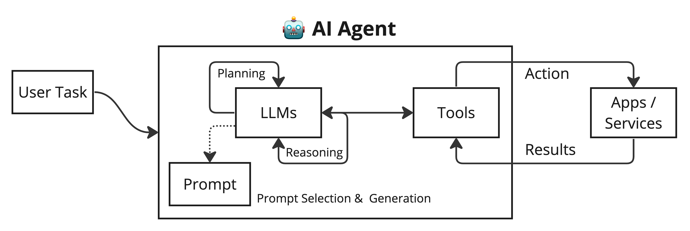

# LLM-powered Autonomous AI Agents

LLMs has potential to use beyond text generation, summarization, and code generation. LLM models are reasoning engines not knowledge databases. They can,
- Turned into a powerful general problem solver.
- Extend to automate complex workflows.
- Could power autonomous systems.

Autonomous AI agents are ... make logical decisions, and handle a number of tasks without constant human input. that operates without consistent human intervention.

maneuver through the daily decisions, tasks, and contextual understanding requirements a human would typically need to handle independently.

hands-on guidance,
has human-like agency
make decisions independently after interpreting its environment and object-based goals.

## AI Agents Overview (5 min)

In a LLM-powered autonomous agent system, LLM acts as agent’s brain, complemented by several key components:

## How do Autonomous AI Agents Work? 

Autonomous AI agents are trained to work based on given objectives. From those objectives, autonomous agents can then determine the best course of action for tasks, task sequences, etc. based on their current environment, significant patterns and anomalies, and other variables that may impact performance.

### LLM-powered Agents Architecture (7 mins)

### Automation Patterns - (5 mins)

## Frameworks & Libraries to build Autonoums AI Agents - (10 mins)

### Vector Datatabases

### Agent Frameworks

## Use case 1: Autonomous Travel AI Agent - (5 mins)

### Use Case Overview

### Demo

### Code Walkthrough

## Use case 2: Tanzu Kubernetes Autonomous AI Agent - (10 mins)

### Use case overview

### Demo & Code Walkthrough

## QA

### Credits & References

- https://www.eweek.com/artificial-intelligence/autonomous-ai-agents/
